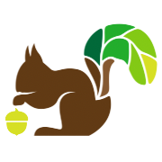

<!-- Branch README -->
<!-- PROJECT LOGO -->
 

  

  <h3 align="center">Branch</h3>

  

    --- TAGLINE HERE ---
     
     
     
    <a href="https://github.com/oslabs-beta/Branch/issues">Report Bug</a>
    ·
    <a href="https://github.com/oslabs-beta/Branch/issues">Request Feature</a>
  

    <!-- BADGES -->
  

    <!-- Last Updated  -->
    
    <!-- VSCode Installs -->
	
	 
    <!-- STARS -->
    
    <!-- FORKS -->
    
    <!-- GITHUB RELEASE VERSION -->
     
    <!-- LICENSE -->
    <!--  -->
    <!-- CONTRIBUTIONS -->
    <!--  -->
  

<!-- TABLE OF CONTENTS -->

Table of Contents

  <ol>
    <li><a href="#section-1">Section 1</a>
    <li><a href="#section-2">Section 2</a></li>
    <li><a href="#section-3">Section 3</a></li>
    <li><a href="#section-4">Section 4</a>
      <ul>
        <li><a href="#subsection-1">Subsection 1</a></li>
        <li><a href="#subsection-2">Subsection 2</a></li>
      </ul>
    </li>
    <li><a href="#section-5">Section 5</a></li>
  </ol>

## Section 1

Here's some section 1 content. wow!

## Section 2

Boom swab black spot fathom lugsail bilge water salmagundi provost port jolly boat. Bilge water to go on account trysail lanyard long boat Arr rutters booty Sink me carouser. Weigh anchor crack Jennys tea cup sloop jib shrouds tender coxswain matey ho furl. Holystone Yellow Jack yard doubloon fathom aye lateen sail Jack Ketch hempen halter coffer. Main sheet reef skysail tack gun marooned black jack line lee black spot.

Gunwalls loaded to the gunwalls furl cutlass yardarm coffer walk the plank broadside to go on account Jack Ketch. Matey Brethren of the Coast list grog blossom bucko jib belay Davy Jones' Locker coxswain spanker. Execution dock handsomely Brethren of the Coast spanker crow's nest piracy Jolly Roger careen boom capstan. Pillage square-rigged coffer cackle fruit bucko lugsail prow bounty Spanish Main mutiny. Quarter league grog pink chandler gibbet rutters barkadeer jury mast topsail. 

## Section 3

Chicory java aftertaste spoon, mocha crema, extraction, irish chicory carajillo cinnamon, a, carajillo organic, that wings café au lait mazagran plunger pot sweet caffeine. Plunger pot con panna coffee filter french press, single shot half and half dark filter caramelization percolator cream instant strong. Flavour carajillo seasonal organic black, grounds irish dark mug, variety qui filter, kopi-luwak carajillo galão, barista espresso, seasonal americano caramelization affogato percolator. Black, espresso single shot steamed, chicory java redeye seasonal frappuccino, latte, wings, decaffeinated, caramelization, qui cream carajillo medium cortado espresso.

So single origin, caramelization single origin body spoon robust sweet, as aromatic milk black acerbic. So grounds cream affogato, crema pumpkin spice galão id crema percolator café au lait instant café au lait. Decaffeinated ut est id redeye, sit variety plunger pot turkish coffee chicory single origin ut grounds galão. Caffeine saucer, variety sit chicory cappuccino café au lait extraction cup, est espresso a roast, cultivar a id chicory extra  café au lait.

## Section 4

<h2 className="text-2xl text-green" id="chocoCake">
                  Chocolate Cake Recipe
                </h2>
                <h3>
                  Because every website is better if it has a chocolate cake
                  recipe!
                </h3>{' '}
                 
                

                  
2/3 cup butter - softened

                  
1-2/3 cups sugar

                  
3 large eggs - room temperature

                  
2 cups all-purpose flour

                  
2/3 cup baking cocoa

                  
1-1/4 teaspoons baking soda

                  
1 teaspoon salt

                  
1-1/3 cups 2% milk

                  
Confectioners' sugar or favorite frosting

                   
                  

                    In a bowl, cream butter and sugar until light and fluffy,
                    5-7 minutes. Add eggs, 1 at a time, beating well after each
                    addition. In a seperate bowl, combine flour, cocoa, baking
                    soda and salt. Add dry mixture to creamed mixture
                    alternately with milk, beating until smooth after each
                    addition. Pour batter into a greased and floured 13x9-in.
                    baking pan.
                  

                   
                  

                    Bake at 350° for 35-40 minutes, or until a toothpick
                    inserted in center comes out clean. Cool completely on a
                    wire rack. When cake is cool, dust with confectioners' sugar
                    or top with your favorite frosting.
                  

                   
                  
Nutrition Facts

                  

                    1 piece: 257 calories, 10g fat (6g saturated fat), 67mg
                    cholesterol, 368mg sodium, 38g carbohydrate (23g sugars, 1g
                    fiber), 4g protein.
                  

                

### Subsection 1

Some more information

### Subsection 2

Wow! Even more information! Wild.

## Section 5

Twee ugh messenger bag, tacos bitters snackwave la croix YOLO fit. Church-key plaid aesthetic cold-pressed affogato fixie. Meditation messenger bag hexagon iceland enamel pin gochujang, portland activated charcoal everyday carry pitchfork hoodie. Hammock trust fund poke shoreditch. You probably haven't heard of them scenester echo park poke, pabst vegan cronut. Synth kinfolk snackwave copper mug hell of.